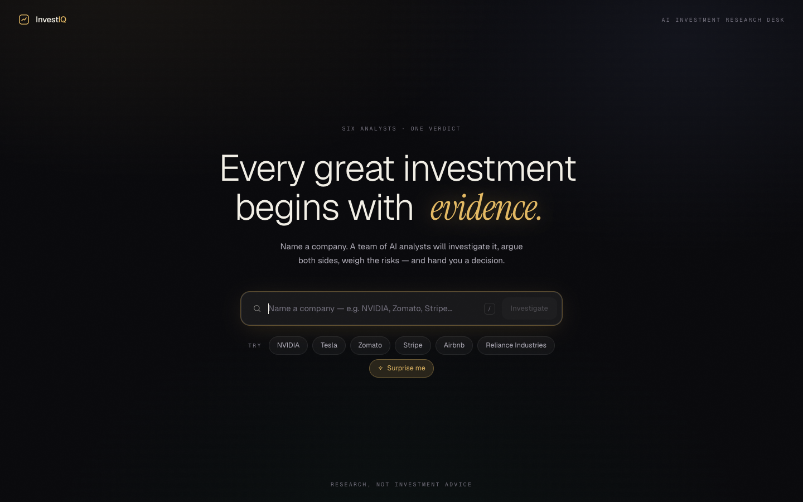
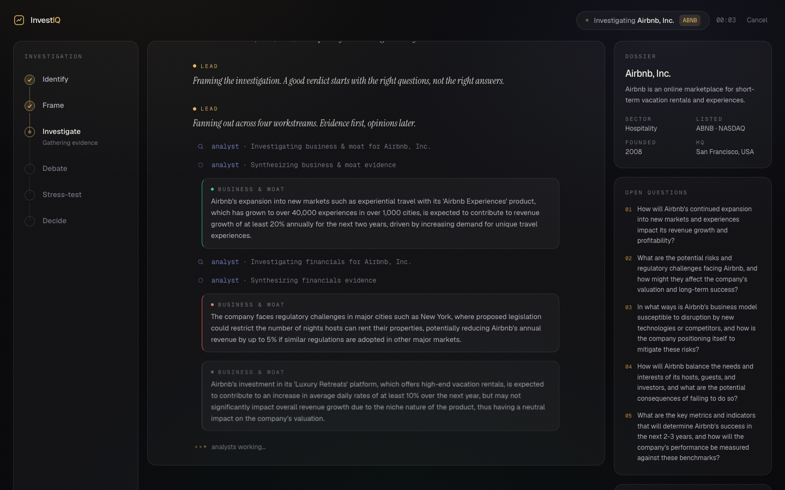
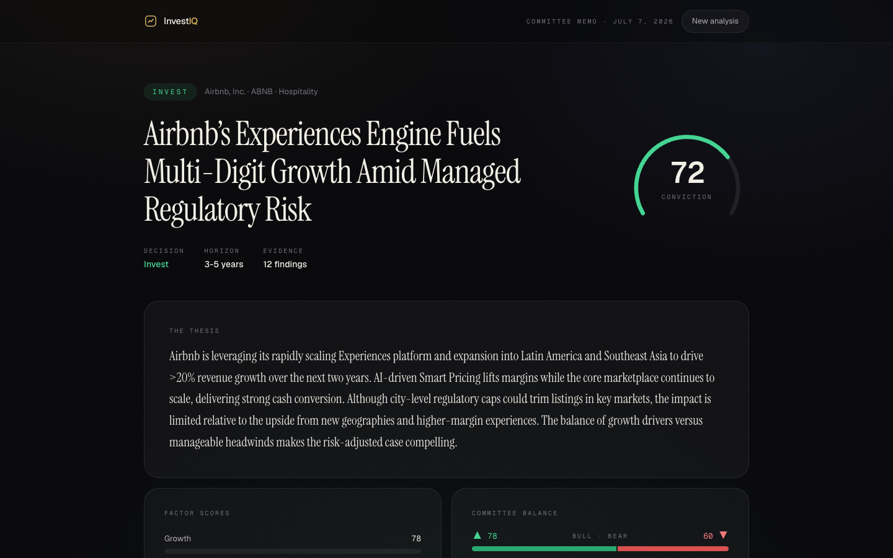
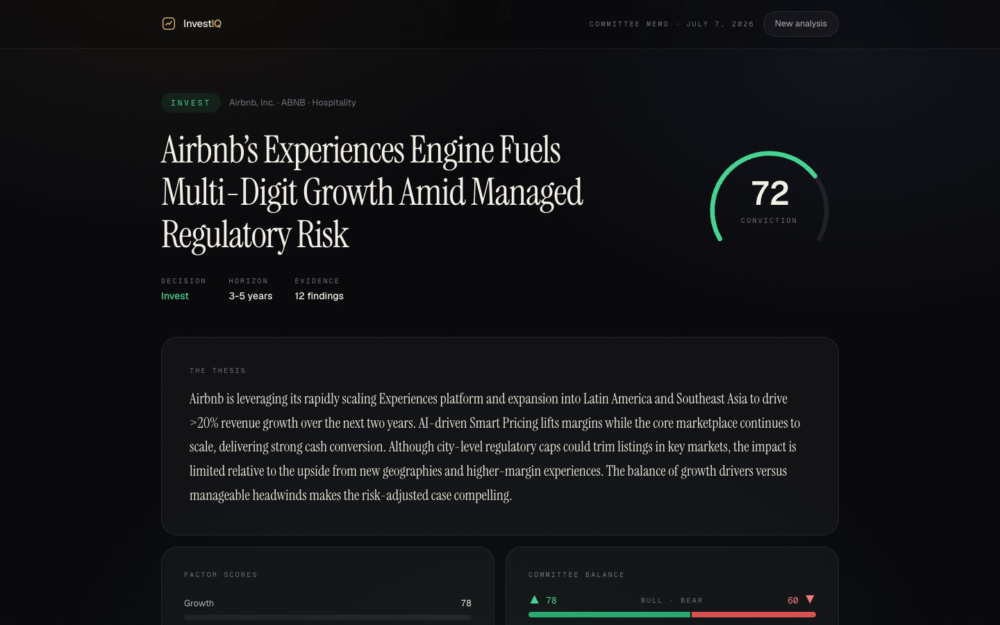

# InvestIQ — AI Investment Research Agent

> Name a company. A team of AI analysts investigates it, argues both sides,
> weighs the risks — and hands you an **INVEST / PASS** verdict with the full
> reasoning behind it.

Built for the InsideIIM × Altuni AI Labs take-home. Stack: **Next.js (App
Router) · LangGraph.js · LangChain.js · TypeScript · Tailwind CSS v4 · Motion**.

| Landing | Research Theater | Verdict | Decision Memo |
|---|---|---|---|
|  |  |  |  |

---

## Overview

InvestIQ is not a chatbot with a finance prompt. It is a staged, multi-agent
research pipeline rendered as a cinematic experience in three acts:

1. **Landing** — a command bar. Type a company (or hit *Surprise me*).
2. **Research Theater** — you watch the investigation live: a phase rail
   (Identify → Frame → Investigate → Debate → Stress-test → Decide), a
   streaming feed of analyst thoughts, actions, sources and findings, and a
   dossier that fills in as evidence lands.
3. **Decision Memo** — a committee-grade report: verdict stamp, conviction
   gauge, thesis, six factor scores, the bull and bear cases side by side, a
   severity × likelihood risk matrix, "what would change our mind", and the
   full evidence trail.

Every stage of the pipeline streams its work to the browser over SSE, so the
UI is a live window into the agent — not a spinner followed by a wall of text.

## How to run it

```bash
npm install
cp .env.example .env.local   # add at least one provider key
npm run dev                  # http://localhost:3000
```

### Keys / env

The app needs **at least one** LLM provider key in `.env.local` (all have free
tiers). More keys = more fallback capacity:

| Env var | Provider | Get a key at |
|---|---|---|
| `GEMINI_API_KEY` | Google Gemini (`gemini-2.5-flash`) | aistudio.google.com |
| `GROQ_API_KEY` | Groq (`llama-3.3-70b`, `gpt-oss-120b`) | console.groq.com |
| `CEREBRAS_API_KEY` | Cerebras (`gpt-oss-120b`, `zai-glm-4.7`) | cloud.cerebras.ai |
| `OPENROUTER_API_KEY_1/2` | OpenRouter `:free` models | openrouter.ai |
| `SWIFTROUTER_API_KEY` | SwiftRouter (`glm-4.7`, `command-r`) | swiftrouter.com |
| `TAVILY_API_KEY` *(optional)* | Live web-search grounding | tavily.com |

Without `TAVILY_API_KEY` the analysts work from model knowledge; with it, the
research phase pulls live web sources and cites them in the report.

## How it works

### Architecture

```
Browser ── POST /api/research (SSE) ──▶ Next.js route handler (Node runtime)
                                            │
                                            ▼
                                LangGraph.js StateGraph
   resolve ─▶ plan ─▶ research (4 parallel facets) ─▶ debate (bull ∥ bear)
                                            ─▶ risk ─▶ verdict
                                            │
                            every node emits typed events
                                            │
                                            ▼
                          multi-provider LLM router (fallback + rotation)
             Gemini → Groq → Cerebras → OpenRouter ×2 → SwiftRouter
```

- **`src/lib/agent/graph.ts`** — the LangGraph pipeline. Six nodes, one per
  research stage. The research node fans out across four facets (business &
  moat, financials, market & competition, catalysts & news) in parallel; the
  debate node runs the bull and bear advocates concurrently. Every node
  narrates its work through an `emit` callback.
- **`src/lib/agent/llm.ts`** — the reliability layer. Every structured call
  walks an ordered chain of OpenAI-compatible providers. A candidate that
  errors, rate-limits, times out, or returns JSON that fails schema validation
  is skipped (with a cooldown) and the next takes over — the product keeps
  working even when free tiers throttle. Zod schemas are rendered into the
  prompt, and responses are repaired (fence-stripping, truncation-closing,
  wrapper-unwrapping) before validation.
- **`src/app/api/research/route.ts`** — streams the event flow to the client
  as Server-Sent Events with heartbeats.
- **`src/lib/useResearch.ts`** — client hook that consumes the stream and
  reduces it into UI state.
- **`src/components/`** — Landing, Theater, Report, and validated-palette
  data-viz primitives (conviction gauge, factor bars, balance meter, risk
  matrix).

### The agent team

| Stage | Agent | Job |
|---|---|---|
| Identify | Lead | Verify the company, ticker, sector |
| Frame | Lead | Draft the 4–5 questions that decide the call |
| Investigate | Scouts + Analysts | Four parallel evidence workstreams (optionally web-grounded) |
| Debate | Bull desk vs. Bear desk | Argue both sides honestly, self-rate conviction |
| Stress-test | Risk officer | 3–5 material risks, severity × likelihood, mitigants |
| Decide | CIO | INVEST / PASS / WATCH, conviction, thesis, factor scores |

## Key decisions & trade-offs

- **LangGraph for orchestration, custom router for calls.** The graph gives
  the pipeline explicit stages, state, and conditional edges (unknown company →
  early exit). LLM calls go through my own fallback router over LangChain's
  `ChatOpenAI` rather than a single provider binding, because the brief for
  this build was: *it must work all the time* on free-tier keys.
- **Prompt-schema JSON instead of native tool-calling.** Tool-call support is
  inconsistent across free models; a rendered zod spec + tolerant parsing +
  validation-triggered rotation proved far more robust in testing.
- **SSE over WebSockets.** One-directional streaming is all this needs; SSE
  survives proxies and deploys on Vercel without extra infra.
- **Real runs only, no mocked demo mode.** The trade-off is a run takes
  ~1–3 minutes; the Theater turns that wait into the product's centerpiece.
- **Left out:** persistence/history, auth, PDF export, financial-data APIs
  (see improvements).

## Example runs

*(model outputs vary run to run; these are representative)*

**NVIDIA — INVEST, conviction 85/100, horizon 3–5y.**
"NVIDIA's Diversification and Moat Propel Long-Term Growth." Factors: Growth
90 · Profitability 85 · Moat 95 · Valuation 80 · Momentum 85 · Management 90.
Bear desk flagged valuation and custom-silicon competition; risk register led
by AI-capex cyclicality.

**Tesla — verdict is run-dependent (WATCH/INVEST), conviction ~65.**
Committee split: bull desk argued FSD/energy optionality, bear desk argued
margin compression from price cuts and BYD competition; verdict hinged on
valuation risk.

**Zomato — INVEST, conviction ~75.**
Thesis built on food-delivery duopoly economics, Blinkit's quick-commerce
growth, and improving unit economics; key risk was quick-commerce cash burn.

## What I'd improve with more time

- **Real financial data**: pull fundamentals (revenue, margins, multiples)
  from a market-data API and chart them in the report.
- **Deeper agent debate**: a second rebuttal round where each desk attacks
  the other's strongest point before the CIO decides.
- **Run history + shareable reports**: persist memos, shareable URLs, PDF
  export.
- **Token/citation-level streaming**: stream thesis text token by token and
  anchor findings to specific source passages.
- **Evaluation harness**: score verdict consistency across reruns and models.

---

*InvestIQ produces AI-generated research for educational purposes — not
investment advice.*
